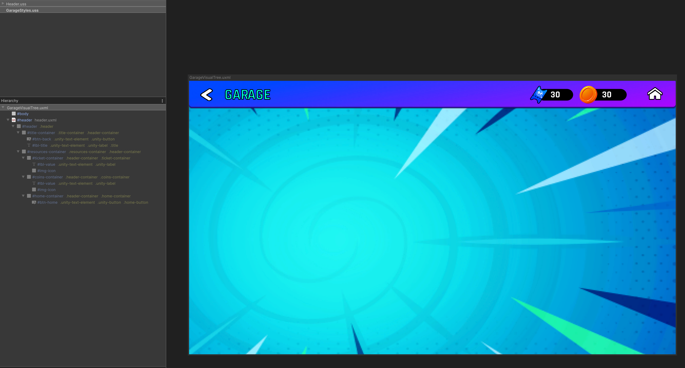
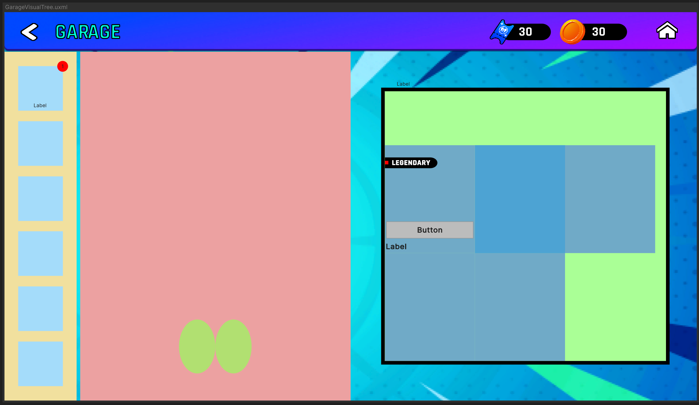
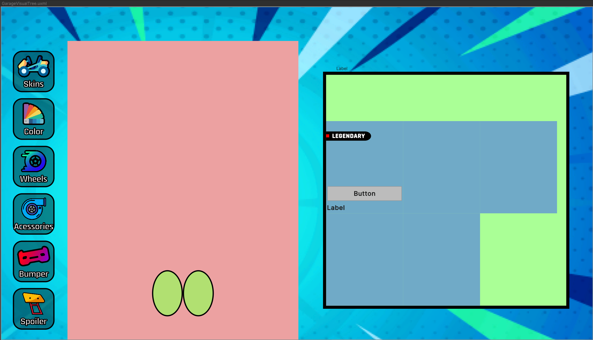
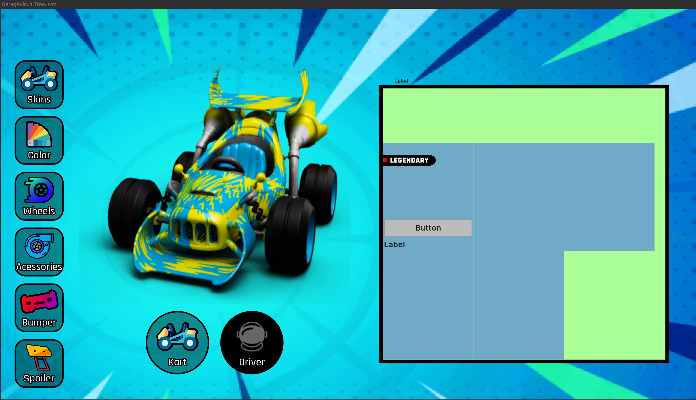
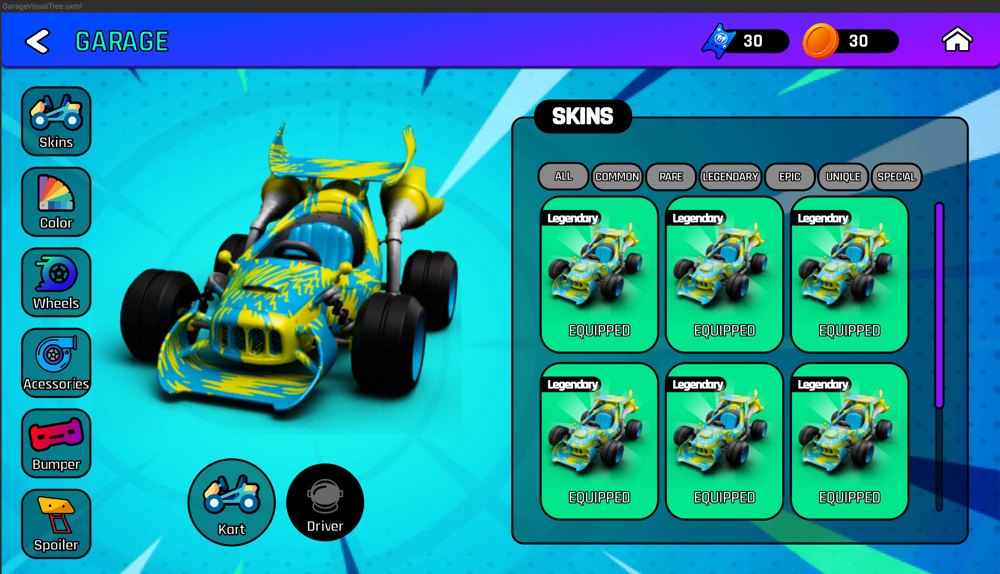

# Exploração

Apenas compartilhando meu processo de exploração do projeto.

## Início - Criando o Header
Como eu não sabia nada sobre o UIToolkit, decidi fazer o header sem planejar muito o sistema. Assim, eu poderia lembrar de algumas coisas de CSS e aplicar o que fui aprendendo de UIToolkit.

Escolhi o header pois é uma estrutura separada do projeto que eu poderia reutilizar em outras páginas.

Após terminar, eu separei ele em um template apartado da estrutura da tela Garage que eu iria fazer.

## Backbone da tela
Com o header pronto eu já sabia o suficiente pra começar a planejar o projeto.

Criei um desenho simples da estrutura de como ficariam as partes da tela e apliquei ele usando cores de background para separar os elementos visualmente.

## Desenvolvimento do Front
Eu separei o front em 3 partes: barra lateral, container de preview e container de conteúdo.

Não tive muitos problemas nessa parte além dos problemas para lembrar como fazer as coisas em css.  
Nessa fase eu criei só a tela e deixei a funcionalidade para depois de terminar elas.

#### Tabs

#### Showcase

#### Content Container

## Desenvolvimento do Back
Essa parte teve um pouquinho mais de trabalho. Fiz uma série de coisas:
- Criei um database para guardar os assets do jogo
- Criei métodos helper para popular o jogo baseado nas imagens
- Criei um UIController que faz a inicialização de todos os componentes da tela
- Criei um PlayerData, uma classe para guardar os equipamentos do jogados (os dados não são persistentes através de sessões)

## Conclusão

Minhas maiores dificuldades técnicas se deram porque eu não conhecia muito o UIToolkit. 
Além disso, como eu não lembrava muito de css, algumas coisas da organização ficaram ruins no começo (não usei BEM no projeto inteiro, por exemplo).

No geral, gostei bastante da ferramenta e acredito que irei adotá-la nos meus projetos pessoais.